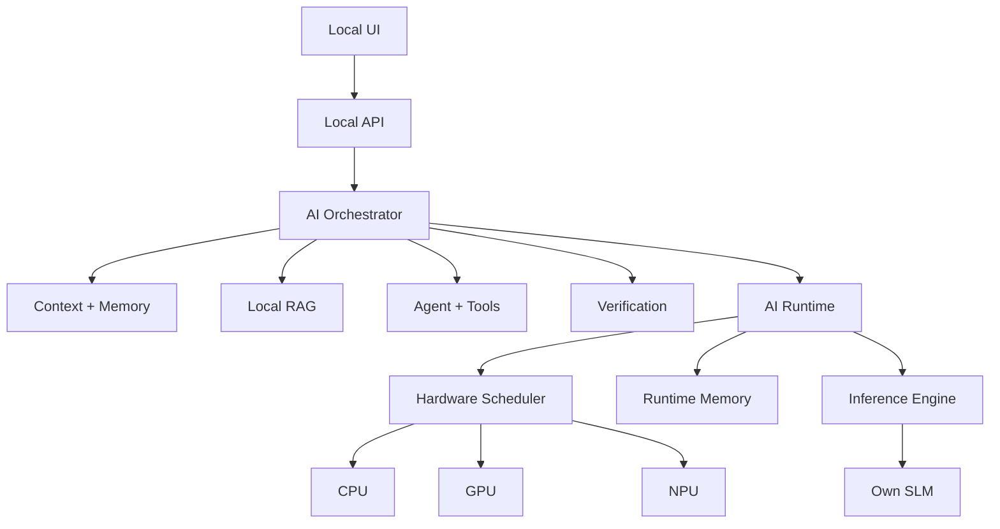

# ARIA

**ARIA — Autonomous Research & Intelligence Architecture**

A clean-room, local-first AI system built around a trainable Small Language Model (SLM), a hardware-aware runtime, controlled tools, local memory/RAG, measurable evaluation, and an offline operating mode.

> **ARIA is not a chatbot wrapper.**
> The long-term goal is a genuinely independent AI system whose intelligence comes from its own architecture, learned parameters, tokenizer, training pipeline, and inference stack.


---

## What ARIA is building

ARIA separates intelligence, execution, action, knowledge, and interaction into explicit layers:



The responsibilities stay deliberately separate:

| Layer | Responsibility |
|---|---|
| **SLM** | Learned language intelligence |
| **Tokenizer** | Converts local text into model tokens |
| **Inference engine** | Executes autoregressive generation |
| **AI runtime** | Manages execution, memory, models, and performance |
| **Hardware scheduler** | Selects CPU/GPU/NPU based on measured capability |
| **Memory** | Local working, conversational, semantic, and episodic state |
| **RAG** | Local document retrieval and context selection |
| **Agent** | Controlled planning and tool execution |
| **Verification** | Tests generated results instead of trusting them blindly |
| **API** | Stable boundary between UI and local intelligence |
| **UI** | Human interaction and runtime transparency |
| **Evaluation** | Measures quality, latency, memory, and regressions |

## Independence by design

Normal operation is intended to work without:

- OpenAI, Anthropic, Gemini, or other model APIs
- cloud inference
- cloud embeddings
- hosted vector databases
- remote agent services
- hidden telemetry
- required internet access

Development-time internet access may be used when explicitly needed for dependencies, datasets, documentation, or optional model artifacts. The finished system must have an explicit **network-isolation test**.

This requirement is part of the engineering contract, not a marketing claim.

## Engineering truth

ARIA will not claim a capability because a button, class, or mock exists.

If the system says it is:

- **trained** → training configuration, data version, loss, evaluation, and model version must exist
- **GPU accelerated** → measured device execution and performance must be available
- **NPU accelerated** → actual NPU execution and supported operators must be demonstrated
- **offline** → the system must pass a network-isolation test
- **faster** → a reproducible benchmark must show the improvement
- **human-like** → conversational quality must be evaluated against a defined test set

Unimplemented work is marked **NOT IMPLEMENTED**. Experimental work is marked **EXPERIMENTAL**.

## Current status

**Foundation phase — clean-room reset completed.**

This repository currently contains architecture contracts and project boundaries only. It intentionally does **not** pretend to have a working SLM, hardware scheduler, RAG system, agent, or UI yet.

### Implemented in this foundation

- clean project structure
- explicit package boundaries
- core architecture contracts
- hardware-profile data model
- project documentation and roadmap
- packaging configuration
- repository hygiene

### Not implemented yet

- hardware discovery
- SLM architecture
- tokenizer
- training
- inference
- KV cache
- quantization
- hardware scheduler
- memory manager
- local embeddings/index
- RAG
- agent execution
- local API
- UI
- evaluation suite
- offline/network isolation test

That distinction is intentional.

## Architecture map

The repository is organized around the execution path rather than around a collection of unrelated features:

```text
User
 │
 ▼
UI
 │
 ▼
Local API
 │
 ▼
Orchestrator
 ├──────────────► Context / Memory
 ├──────────────► Local RAG
 ├──────────────► Agent / Tools
 └──────────────► Verification
                    │
                    ▼
               AI Runtime
                    │
        ┌───────────┼───────────┐
        ▼           ▼           ▼
      CPU          GPU         NPU
                    │
                    ▼
                   SLM
```

A larger visual version is maintained at [docs/architecture.svg](docs/architecture.svg).

## Repository structure

```text
ARIA/
├── docs/
│   ├── architecture.svg
│   └── ROADMAP.md
├── src/
│   └── aria/
│       ├── core/
│       │   └── contracts.py
│       ├── hardware/
│       │   └── models.py
│       ├── model/
│       ├── runtime/
│       ├── __init__.py
│       └── __main__.py
├── tests/
├── .gitignore
├── pyproject.toml
└── README.md
```

The structure will grow only when a real implementation requires it.

## Development sequence

ARIA follows a measurable build sequence:

1. **Hardware & feasibility** — inspect the actual machine and establish realistic model/runtime limits.
2. **Architecture** — freeze stable interfaces between model, runtime, memory, tools, API, and UI.
3. **Tokenizer** — build and benchmark English, Hindi, Hinglish, code, math, and technical tokenization.
4. **SLM** — implement a real decoder-only model with forward pass, loss, backpropagation, checkpoints, and generation.
5. **Training** — build reproducible pretraining and instruction-training pipelines.
6. **Inference** — add streaming generation, KV cache, efficient sampling, and quantization where justified.
7. **Hardware runtime** — discover CPU/GPU/NPU capabilities and benchmark execution paths.
8. **Memory** — implement local persistent, inspectable, editable memory.
9. **RAG** — index and retrieve local documents without cloud embeddings.
10. **Agent** — add sandboxed tools, permissions, validation, and audit logging.
11. **API** — expose the local system through a stable interface.
12. **UI** — build the interaction layer after the underlying system is real.
13. **Evaluation** — establish quality and performance regression tests.
14. **Optimization** — optimize only where benchmarks show a real bottleneck.
15. **Security** — audit tools, files, commands, paths, and resource limits.
16. **Offline production** — disable networking and verify the complete local operating mode.

See [docs/ROADMAP.md](docs/ROADMAP.md) for milestone boundaries.

## Design principles

### 1. Local first

The normal runtime should not need the internet.

### 2. Measurable over impressive

A feature is complete when it works and can be tested, benchmarked, or inspected.

### 3. Hardware-aware

CPU, GPU, and NPU are execution resources—not badges. ARIA will benchmark before choosing heterogeneous execution.

### 4. Small first

The first SLM should be small enough to train, debug, evaluate, and understand locally. Scaling comes after evidence.

### 5. No fake intelligence

Prompts, templates, hard-coded answers, or API wrappers are not substitutes for learned model capability.

### 6. Controlled agency

Tools receive explicit schemas, validation, permissions, sandboxing, timeouts, and resource limits.

### 7. Research-friendly boundaries

Stable interfaces should make future work such as MoE, sparse attention, distillation, LoRA/QLoRA, speculative decoding, pruning, and multimodality possible without rewriting the entire system.

### 8. Privacy by default

Local storage, no automatic uploads, no hidden telemetry, and inspectable memory are the default direction.

## Technology direction

The initial implementation will evaluate—not blindly assume—the following ecosystem:

- Python + PyTorch for model research and training
- SentencePiece / Hugging Face Tokenizers / custom tokenizer where justified
- FastAPI or an equivalent local API layer
- SQLite for local structured state
- FAISS or another local retrieval index
- React / Next.js or equivalent for the UI
- hardware-specific CPU/GPU/NPU backends selected after machine discovery

The final stack is a consequence of measured constraints, not a starting assumption.

## Versioning

ARIA versions its major system layers independently:

```text
SLM      → SLM-0.x
Runtime  → Runtime-0.x
Agent    → Agent-0.x
UI       → UI-0.x
```

Each model release will record architecture, parameter count, tokenizer version, dataset version, training configuration, evaluation results, hardware used, and known limitations.

## Contribution workflow

Each development block should follow:

```text
Inspect
  ↓
Measure
  ↓
Design smallest correct change
  ↓
Implement
  ↓
Test
  ↓
Benchmark when relevant
  ↓
Review what changed
  ↓
Commit
```

Do not build a large feature on top of an unverified foundation.

## The long-term target

The target is a locally executable system capable of:

- natural conversation
- contextual understanding
- coding
- mathematics
- technical explanation
- local document understanding
- persistent local memory
- local retrieval
- controlled tool use
- result verification
- measurable model improvement
- model versioning
- hardware-aware execution
- quantized inference
- streaming generation
- offline operation

The target is **not** to reproduce the appearance of a hosted AI product.

> **Build actual capability. Measure it. Keep the boundaries honest.**

## License

Apache-2.0. See the repository license file when the licensing artifact is added to the project.
