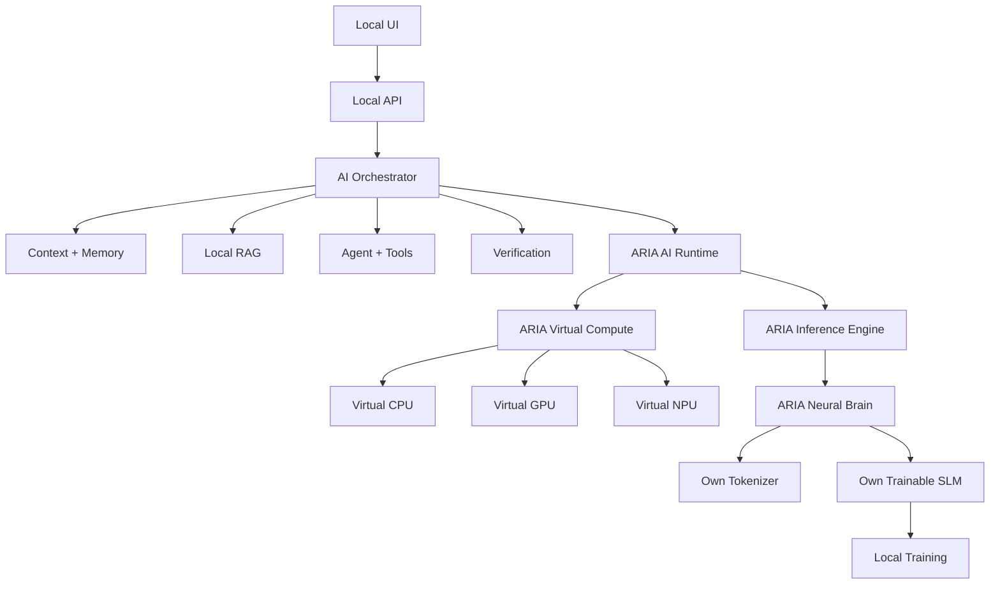

# ARIA

**ARIA — Autonomous Research & Intelligence Architecture**

ARIA is a self-contained, local-first AI system designed to build its own intelligence stack: its own neural language model, tokenizer, training pipeline, inference engine, memory, local RAG, agent runtime, evaluation system, and **ARIA-owned virtual compute layer**.

> **ARIA is not a chatbot wrapper.**
> The goal is an independently engineered AI system whose core intelligence comes from a trainable neural network and supporting software built and evaluated inside this repository.


---

## What ARIA is building

ARIA separates **learned intelligence**, execution, knowledge, action, and interaction into explicit software layers.



## The ARIA neural brain

The neural network is not a service ARIA calls. **It is a component ARIA owns and trains.**

The intended intelligence path is:

```text
Text
  ↓
ARIA Tokenizer
  ↓
Token IDs
  ↓
ARIA Neural Network / SLM
  ├── Embeddings
  ├── Transformer layers
  ├── Attention
  ├── Feed-forward blocks
  ├── Normalization
  └── Vocabulary head
  ↓
Next-token probabilities
  ↓
ARIA Inference Engine
  ↓
Generated text
```

The current model implementation is deliberately small: a trainable embedding + vocabulary projection language model with real forward computation, softmax loss, backpropagation, parameter updates, generation, and local checkpointing. It is the first **brain foundation**, not the final SLM.

The final ARIA SLM will grow from this foundation toward an efficient decoder-only Transformer. Architectural additions such as RoPE, RMSNorm, SwiGLU, GQA/MQA, KV caching, quantization, and other optimizations will be introduced only when they are implemented and measured.

### What makes this different from an API wrapper

ARIA's normal runtime does **not** depend on:

- OpenAI, Anthropic, Gemini, or another hosted model API
- cloud inference
- cloud embeddings
- hosted vector databases
- remote agent services
- hidden model calls

The neural model, tokenizer, training loop, inference logic, memory, retrieval, tool orchestration, and runtime boundaries are intended to be local ARIA components.

---

## ARIA virtual compute

**ARIA's CPU, GPU, and NPU are software-defined compute engines owned by ARIA.**

They are not physical devices that ARIA must provide, detect, or depend on.

The host computer is simply the environment that runs ARIA. Optional host acceleration can be added later without making physical GPU/NPU hardware a core requirement.

| Layer | Responsibility |
|---|---|
| **Neural Brain / SLM** | Learned language intelligence |
| **Tokenizer** | Converts local language, code, mathematics, and technical text into model tokens |
| **Inference Engine** | Executes the model and generates tokens |
| **Training Engine** | Learns model parameters from local training data |
| **Virtual CPU** | General-purpose software execution |
| **Virtual GPU** | Parallel-style tensor/matrix execution in software |
| **Virtual NPU** | Neural-network-oriented execution in software |
| **AI Runtime** | Model loading, execution, scheduling, memory, and runtime state |
| **Memory** | Local working, conversational, semantic, and episodic state |
| **RAG** | Local document retrieval and context selection |
| **Agent** | Controlled planning and tool execution |
| **Verification** | Checks generated results instead of blindly trusting them |
| **API** | Stable local boundary between UI and intelligence |
| **UI** | Human interaction and runtime transparency |
| **Evaluation** | Measures quality, correctness, speed, and regressions |

## Independence by design

Normal operation is intended to work without:

- external AI/model APIs
- cloud inference
- cloud embeddings
- hosted vector databases
- remote agent services
- hidden telemetry
- required internet access
- required physical GPU or NPU hardware

Development-time internet access may be used when explicitly needed for dependencies, datasets, documentation, or optional artifacts. The finished system must have an explicit network-isolation test.

This is an engineering requirement, not a claim that every planned subsystem is already complete.

## Engineering truth

ARIA will not claim a capability because a button, class, or mock exists.

If the system says it is:

- **trained** → training configuration, data version, loss, evaluation, and model version must exist
- **a neural model** → real parameters, forward computation, loss, backpropagation, and parameter updates must exist
- **offline** → the system must pass a network-isolation test
- **faster** → a reproducible benchmark must show the improvement
- **human-like** → conversational quality must be evaluated against a defined test set

Unimplemented work is marked **NOT IMPLEMENTED**. Experimental work is marked **EXPERIMENTAL**.

## Current status

**Clean repository — ready for Block 0.**

The repository has intentionally been reset before implementation begins.

### Implemented

- project specification in this README

### Not implemented

- repository/package foundation
- neural tensor backend
- tokenizer
- neural SLM
- training engine
- inference engine
- runtime
- memory
- local RAG
- agent/tools
- verification
- local API
- UI
- evaluation
- security testing
- offline/network-isolation testing

This is intentional. No prototype implementation is being treated as production ARIA.

## Architecture map

```text
User
 │
 ▼
UI
 │
 ▼
Local API
 │
 ▼
AI Orchestrator
 ├──────────────► Context / Memory
 ├──────────────► Local RAG
 ├──────────────► Agent / Tools
 └──────────────► Verification
                    │
                    ▼
              ARIA AI Runtime
                    │
          ┌─────────┴─────────┐
          ▼                   ▼
   Virtual Compute       Inference Engine
          │                   │
     ┌────┼────┐              ▼
     ▼    ▼    ▼        ARIA Neural Brain
   VCPU VGPU VNPU              │
                               ▼
                         Own Trainable SLM
                               │
                               ▼
                         Local Parameters
```

## Repository structure

```text
ARIA/
└── README.md
```

The first implementation block will establish the engineering foundation without importing assumptions from the removed prototypes.

## Development sequence

ARIA is being built block-by-block:

1. **Software feasibility & architecture** — define realistic boundaries and execution contracts. **COMPLETE**
2. **ARIA virtual compute** — build VCPU, VGPU, VNPU and software kernels. **IN PROGRESS**
3. **Neural brain foundation** — establish a real trainable local language-model core. **IN PROGRESS**
4. **Tokenizer** — local tokenizer for English, Hindi, Hinglish, programming, mathematics, and technical language.
5. **Full SLM** — evolve the neural core into a decoder-only Transformer.
6. **Training** — reproducible pretraining and instruction-training pipelines.
7. **Inference runtime** — streaming generation, KV cache, sampling, and justified quantization.
8. **Runtime orchestration** — route workloads across ARIA's virtual compute engines.
9. **Memory** — persistent, searchable, inspectable, editable local memory.
10. **RAG** — local document parsing, indexing, retrieval, reranking, and context selection.
11. **Agent** — sandboxed tools, permissions, validation, and audit logging.
12. **API** — stable local system boundary.
13. **UI** — interaction layer built on real backend capabilities.
14. **Evaluation** — quality, correctness, performance, and regression tests.
15. **Security & privacy** — audit tools, files, commands, paths, resources, and network behavior.
16. **Optimization & research** — quantization, pruning, distillation, LoRA/QLoRA, speculative decoding, sparse attention, MoE, multimodality, and controlled continual learning.

## Design principles

### 1. Own the brain

ARIA's learned intelligence must come from ARIA-owned model parameters and training code. External model APIs are not substitutes for the neural network.

### 2. Separate brain from runtime

The neural model learns language. The runtime executes it. Memory supplies context. RAG supplies local knowledge. Tools perform controlled actions. The UI only provides interaction.

### 3. Virtual compute is real software

VCPU, VGPU, and VNPU are implementation targets, not labels for physical hardware. Each engine must have executable logic, tests, and measurable behavior.

### 4. Measurable over impressive

A feature is complete when it works and can be tested, benchmarked, or inspected.

### 5. Small first

The first SLM should be small enough to train, debug, evaluate, and understand locally. Scaling comes after evidence.

### 6. No fake intelligence

Prompts, templates, hard-coded answers, or API wrappers are not substitutes for learned model capability.

### 7. Controlled agency

Tools receive explicit schemas, validation, permissions, sandboxing, timeouts, and resource limits.

### 8. Privacy by default

Local storage, no automatic uploads, no hidden telemetry, and inspectable memory are the default direction.

### 9. Research-friendly boundaries

Stable interfaces should allow future model and runtime work without rewriting the entire system.

## Technology direction

The initial implementation will be dependency-light and selected only after the numerical and model requirements are established. Dependencies must be justified by measurable engineering needs.

As the model grows, ARIA may add a local tensor backend for efficient training and inference. Any dependency must serve an identified performance or research need; it must not introduce a hosted AI dependency.

Possible future components include:

- Python for system and research code
- a local tensor backend for model training/inference
- a custom/local tokenizer
- SQLite for local structured state
- a local vector/retrieval index
- a local API layer
- a web UI

## Versioning

ARIA versions major system layers independently:

```text
Compute  → Compute-0.x
Brain    → Brain-0.x
SLM      → SLM-0.x
Runtime  → Runtime-0.x
Agent    → Agent-0.x
UI       → UI-0.x
```

Each model release will record architecture, parameter count, tokenizer version, dataset version, training configuration, evaluation results, compute configuration, and known limitations.

## Contribution workflow

Every block follows:

```text
Inspect
  ↓
Measure
  ↓
Design smallest correct change
  ↓
Implement
  ↓
Test
  ↓
Benchmark when relevant
  ↓
Review
  ↓
Commit
```

Do not build a large feature on top of an unverified foundation.

## Long-term target

ARIA is intended to become a locally executable AI system capable of:

- natural conversation
- contextual understanding
- coding
- mathematics
- technical explanation
- local document understanding
- persistent local memory
- local retrieval
- controlled tool use
- result verification
- measurable model improvement
- model versioning
- virtual compute execution
- quantized inference
- streaming generation
- offline operation

The target is not to reproduce the appearance of a hosted AI product.

> **Build the brain. Build the runtime. Measure both. Keep the boundaries honest.**
