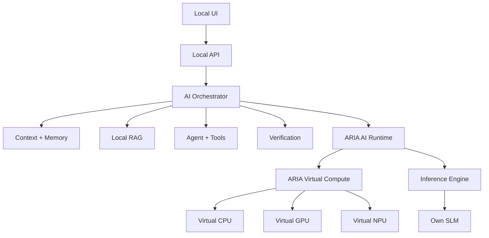

# ARIA

**ARIA — Autonomous Research & Intelligence Architecture**

ARIA is a self-contained, local-first AI system designed to build its own software intelligence stack: its own tokenizer, trainable SLM, inference engine, memory, local RAG, agent runtime, evaluation system, and **ARIA-owned virtual compute layer**.

> **ARIA is not a chatbot wrapper.**
> The goal is an independently engineered AI system whose core capabilities come from software built and evaluated inside this repository.


---

## What ARIA is building

ARIA separates intelligence, execution, knowledge, action, and interaction into explicit software layers.



### The important architecture decision

**ARIA's CPU, GPU, and NPU are software-defined compute engines owned by ARIA.**

They are not physical devices that ARIA must provide, detect, or depend on.

The host computer is simply the environment that runs ARIA. The ARIA runtime owns the execution abstraction and can later add optional host acceleration without changing the core architecture.

| Layer | Responsibility |
|---|---|
| **Virtual CPU** | General-purpose software execution |
| **Virtual GPU** | Parallel-style tensor/matrix execution in software |
| **Virtual NPU** | Neural-network-oriented execution in software |
| **AI Runtime** | Model loading, execution, scheduling, memory, and runtime state |
| **SLM** | Learned language intelligence |
| **Tokenizer** | Converts local language, code, and technical text into model tokens |
| **Inference engine** | Autoregressive generation and model execution |
| **Memory** | Local working, conversational, semantic, and episodic state |
| **RAG** | Local document retrieval and context selection |
| **Agent** | Controlled planning and tool execution |
| **Verification** | Checks generated results instead of blindly trusting them |
| **API** | Stable local boundary between UI and intelligence |
| **UI** | Human interaction and runtime transparency |
| **Evaluation** | Measures quality, correctness, speed, and regressions |

## Independence by design

Normal operation is intended to work without:

- OpenAI, Anthropic, Gemini, or other model APIs
- cloud inference
- cloud embeddings
- hosted vector databases
- remote agent services
- hidden telemetry
- required internet access
- required physical GPU or NPU hardware

Development-time internet access may be used when explicitly needed for dependencies, datasets, documentation, or optional artifacts. The finished system must have an explicit network-isolation test.

This is an engineering requirement, not a marketing claim.

## Engineering truth

ARIA will not claim a capability because a button, class, or mock exists.

If the system says it is:

- **trained** → training configuration, data version, loss, evaluation, and model version must exist
- **running on its virtual GPU** → a real software execution path and tests must exist
- **using its virtual NPU** → actual neural-network-oriented kernels must be demonstrated
- **offline** → the system must pass a network-isolation test
- **faster** → a reproducible benchmark must show the improvement
- **human-like** → conversational quality must be evaluated against a defined test set

Unimplemented work is marked **NOT IMPLEMENTED**. Experimental work is marked **EXPERIMENTAL**.

## Current status

**Foundation + virtual compute block.**

The repository has been reset into a clean architecture and now contains the first real software execution layer.

### Implemented

- clean project structure
- explicit core contracts
- ARIA-owned Virtual CPU
- ARIA-owned Virtual GPU
- ARIA-owned Virtual NPU
- basic software matrix/vector kernels
- compute task typing
- deterministic compute tests
- project documentation and roadmap
- packaging configuration
- repository hygiene

### Not implemented yet

- tokenizer
- SLM architecture
- training
- inference engine
- KV cache
- quantization
- runtime scheduler
- persistent memory
- local embeddings/index
- RAG
- agent execution
- local API
- UI
- evaluation suite
- offline/network isolation test

That distinction is intentional.

## Architecture map

```text
User
 │
 ▼
UI
 │
 ▼
Local API
 │
 ▼
Orchestrator
 ├──────────────► Context / Memory
 ├──────────────► Local RAG
 ├──────────────► Agent / Tools
 └──────────────► Verification
                    │
                    ▼
              ARIA AI Runtime
                    │
             Virtual Compute
          ┌─────────┼─────────┐
          ▼         ▼         ▼
        VCPU       VGPU       VNPU
          └─────────┬─────────┘
                    ▼
                   SLM
```

A larger local visual is maintained at [docs/architecture.svg](docs/architecture.svg).

## Repository structure

```text
ARIA/
├── docs/
│   ├── architecture.svg
│   └── ROADMAP.md
├── src/
│   └── aria/
│       ├── core/
│       │   └── contracts.py
│       ├── compute/
│       │   ├── engine.py
│       │   └── types.py
│       ├── model/
│       ├── runtime/
│       ├── __init__.py
│       └── __main__.py
├── tests/
│   ├── test_compute.py
│   └── test_foundation.py
├── .gitignore
├── pyproject.toml
└── README.md
```

The structure grows only when a real implementation requires it.

## Development sequence

ARIA is being built block-by-block:

1. **Software feasibility & architecture** — define realistic boundaries and execution contracts.
2. **ARIA virtual compute** — build VCPU, VGPU, VNPU and their software kernels.
3. **Tokenizer** — local tokenizer for English, Hindi, Hinglish, programming, mathematics, and technical language.
4. **SLM** — real decoder-only model with forward pass, loss, backpropagation, checkpoints, and generation.
5. **Training** — reproducible pretraining and instruction-training pipelines.
6. **Inference runtime** — streaming generation, KV cache, sampling, and justified quantization.
7. **Runtime orchestration** — route workloads across ARIA's virtual compute engines.
8. **Memory** — persistent, searchable, inspectable, editable local memory.
9. **RAG** — local document parsing, indexing, retrieval, reranking, and context selection.
10. **Agent** — sandboxed tools, permissions, validation, and audit logging.
11. **API** — stable local system boundary.
12. **UI** — interaction layer built on real backend capabilities.
13. **Evaluation** — quality, correctness, performance, and regression tests.
14. **Security & privacy** — audit tools, files, commands, paths, resources, and network behavior.
15. **Optimization & research** — quantization, pruning, distillation, LoRA/QLoRA, speculative decoding, sparse attention, MoE, multimodality, and controlled continual learning.

See [docs/ROADMAP.md](docs/ROADMAP.md) for acceptance criteria.

## Design principles

### 1. Self-contained software

ARIA owns its core execution and intelligence stack. External services are not part of normal operation.

### 2. Virtual compute is real software

VCPU, VGPU, and VNPU are implementation targets, not labels for physical hardware. Each engine must have executable logic, tests, and measurable behavior.

### 3. Measurable over impressive

A feature is complete when it works and can be tested, benchmarked, or inspected.

### 4. Small first

The first SLM should be small enough to train, debug, evaluate, and understand locally. Scaling comes after evidence.

### 5. No fake intelligence

Prompts, templates, hard-coded answers, or API wrappers are not substitutes for learned model capability.

### 6. Controlled agency

Tools receive explicit schemas, validation, permissions, sandboxing, timeouts, and resource limits.

### 7. Privacy by default

Local storage, no automatic uploads, no hidden telemetry, and inspectable memory are the default direction.

### 8. Research-friendly boundaries

Stable interfaces should allow future work without rewriting the entire system.

## Technology direction

The initial implementation is intentionally dependency-light. The stack will be selected from measured requirements.

Possible future components include:

- Python for system and research code
- PyTorch or a lower-level local tensor stack for model development
- a custom/local tokenizer
- SQLite for local structured state
- a local vector/retrieval index
- a local API layer
- a web UI

The final stack is a consequence of implementation evidence, not a starting assumption.

## Versioning

ARIA versions major system layers independently:

```text
Compute  → Compute-0.x
SLM      → SLM-0.x
Runtime  → Runtime-0.x
Agent    → Agent-0.x
UI       → UI-0.x
```

Each model release will record architecture, parameter count, tokenizer version, dataset version, training configuration, evaluation results, compute configuration, and known limitations.

## Contribution workflow

Every block follows:

```text
Inspect
  ↓
Measure
  ↓
Design smallest correct change
  ↓
Implement
  ↓
Test
  ↓
Benchmark when relevant
  ↓
Review
  ↓
Commit
```

Do not build a large feature on top of an unverified foundation.

## Long-term target

ARIA is intended to become a locally executable AI system capable of:

- natural conversation
- contextual understanding
- coding
- mathematics
- technical explanation
- local document understanding
- persistent local memory
- local retrieval
- controlled tool use
- result verification
- measurable model improvement
- model versioning
- virtual compute execution
- quantized inference
- streaming generation
- offline operation

The target is not to reproduce the appearance of a hosted AI product.

> **Build the capability. Measure it. Keep the boundaries honest.**
